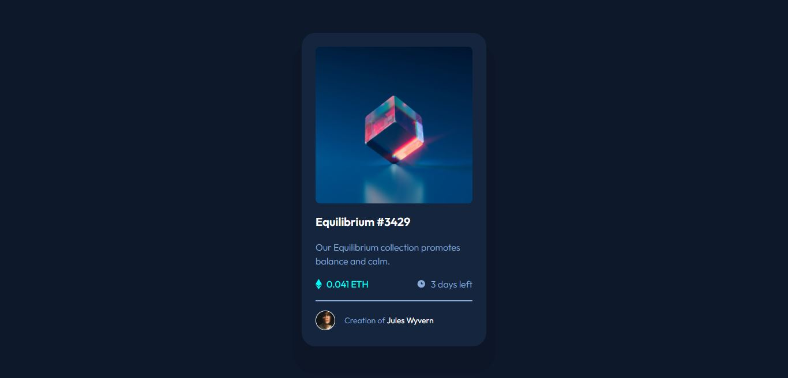

# Frontend Mentor - NFT preview card component solution

This is a solution to the [NFT preview card component challenge on Frontend Mentor](https://www.frontendmentor.io/challenges/nft-preview-card-component-SbdUL_w0U). Frontend Mentor challenges help you improve your coding skills by building realistic projects. 

## Table of contents

- [Overview](#overview)
  - [The challenge](#the-challenge)
  - [Screenshot](#screenshot)
  - [Links](#links)
- [My process](#my-process)
  - [Built with](#built-with)
  - [What I learned](#what-i-learned)
  - [Continued development](#continued-development)
  - [Useful resources](#useful-resources)
- [Author](#author)

## Overview

### The challenge

Users should be able to:

- View the optimal layout depending on their device's screen size
- See hover states for interactive elements

### Screenshot



### Links

- Solution URL: [GitHub](https://github.com/lemartinezm/nft-preview-card-component)
- Live Site URL: [Vercel](https://nft-preview-card-component-steel.vercel.app/)

## My process

### Built with

- HTML
- SCSS
- Flexbox
- Grid
- Mobile-first workflow


### What I learned

Box Shadow property in CSS:

```css
box-shadow: 0 32px 0 16px rgba(0, 0, 0, 0.1);
```

### Continued development

* SASS/SCSS

### Useful resources

- [Box-shadow CSS](https://developer.mozilla.org/en-US/docs/Web/CSS/box-shadow) - This helped me for box-shadow property in CSS.

## Author

- Frontend Mentor - [@lemartinezm](https://www.frontendmentor.io/profile/lemartinezm)
- Twitter - [@Luis14151617](https://twitter.com/Luis14151617)
